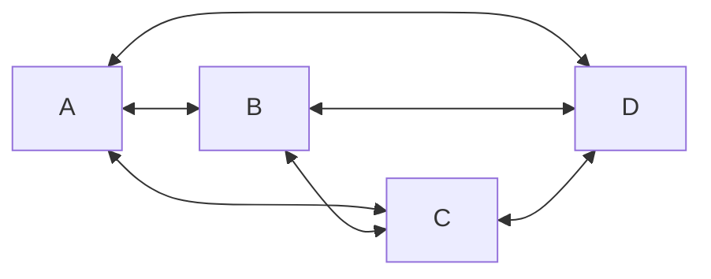

### 外部性
### 网络[[#外部性]]
1. 网络节点越多，价值越大        （贝尔实验室：罗尔夫斯）
在一个图中，网络节点越多产生的链接越多，该网络的价值可以用链接的数量表示（该链接是单向的，如：A->B，B->A算两个链接）


可以列出如下表格：

| node count | 1   | 2   | 3   | 4   | ... | n      |
| ---------- | --- | --- | --- | --- | --- | ------ |
| value      | 0   | 2   | 6   | 12  | ... | n(n-1) |

2. 网络价值正比于节点数的平方    （施乐：梅特卡夫）

    ```chart
        type: line
        labels: [0,10,20,30,40,50,60,70,80,90]
        series:
          - title: 成本1
            data: [0,10,20,30,40,50,60,70,80,90]
		  - title: 成本2
            data: [0,20,40,60,80,100,120,140,160,180]
          - title: 价值
            data: [0,1,2,4,8,16,32,64,128,256]
		xTitle: 节点个数
		yTitle: 金额
    ```

### 行业分析

1. 直接外部性：$v∝n^2$ （n为用户节点个数，v为价值）
	- 电话运营商：移动、联通
	- QQ 微信
2. 间接外部性：$v∝m\cdot n$ （n为生产者节点数，m为消费者节点数）
- 微软、苹果
- 链家
- 产业聚集
- 信用卡
- 互联网平台：抖音、滴滴、淘宝、美团

通过查看边际效益来决定是增加生产者（商家）节点个数还是消费者（用户）节点个数


